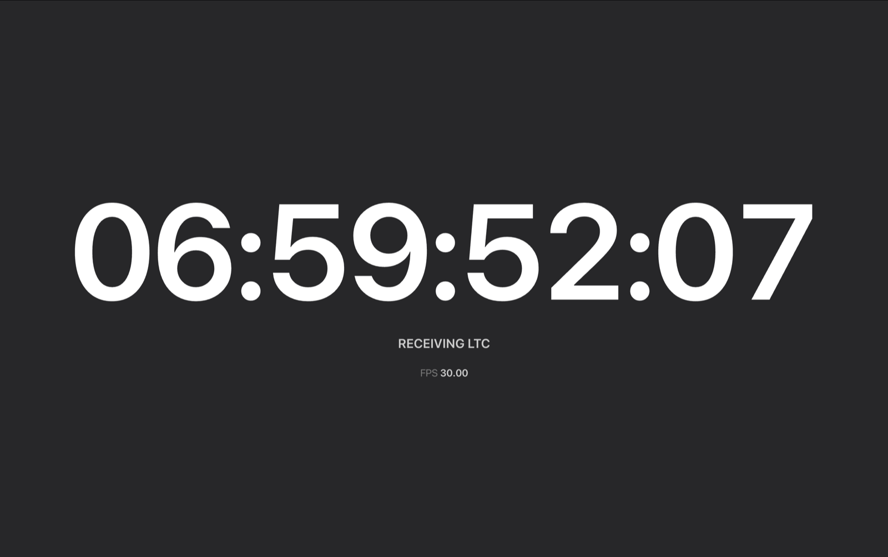

# Adrienne USB-TC — レジスタマップとクロスプラットフォーム実装

Adrienne Electronics 製 SMPTE/EBU タイムコードリーダー **USB-TC** シリーズの
USB プロトコルを解析した記録と、macOS / Linux で動作する Python 実装、および
インストール不要のブラウザ実装。

メーカー公式のドライバは Windows 専用で、macOS 版・Linux 版は存在しない。
USB プロトコルも非公開。本リポジトリはそれを文書化したもの。

**実機をお持ちなら [ブラウザで開いてください](https://hugesesame.github.io/adrienne-usbtc/)。**
インストール不要、ドライバ不要、OS も問わない（Chrome / Edge が必要）。

[](https://hugesesame.github.io/adrienne-usbtc/)

> English version: [README.md](README.md)

---

## 背景

USB-TC シリーズ（`USB-LTC/RDR`、`USB-21VL/RDR`、`USB-IRIG/RDR`）は、小型で
堅牢なハードウェアタイムコードリーダー。2000年代半ばに製造された個体も現在
なお正常に動作するが、通信手段はメーカー製の Windows 用 `.sys` ドライバと
クローズドな SDK DLL のみ。

しかし、この制約に技術的な必然性はない。デバイスはベンダー固有クラスの USB
周辺機器で、**ファームウェアはオンボードに常駐**している。ホストからの
ファームウェア転送も、カーネルドライバも不要。libusb が使える環境なら
ユーザー空間から直接叩ける。

足りなかったのはプロトコルとレジスタマップの情報だけだった。それが本書である。

---

## デバイス識別情報

```
idVendor        0xAECB      ("AECB" = Adrienne Electronics のバニティID)
idProduct       0x6600
bDeviceClass    0xFF        ベンダー固有
bDeviceSubClass 0xFF
bDeviceProtocol 0xFF
bcdUSB          0x0110      USB 1.1
bMaxPacketSize0 8
bMaxPower       100 mA、バスパワー
速度            フルスピード (12 Mbps)
```

挿してみたら正体不明のデバイスが出てきた、という経緯でここに辿り着いた場合、
見ているのはこれである。

```
$ lsusb
Bus 001 Device 007: ID aecb:6600 Adrienne Electronics Corporation
                                 AEC USB-TC Time Code Reader
```

製品文字列は機種で異なる。LTC 専用機は `AEC USB-TC Time Code Reader`、
ビデオ対応機は `AEC USB-TC Time Code and L21 Data Reader`。macOS なら
`ioreg -p IOUSB -l -w 0`、Windows ならデバイスマネージャーで同じ情報が見られる。

デバイスレベルで `bDeviceClass = 0xFF` が立っているため、**どのプラットフォーム
のカーネルドライバもこのデバイスを掴まない**。macOS や Linux ではインターフェース
が未使用のまま残るので、libusb からのアクセスが容易であり、同時に **WebUSB** の
動作要件も満たす。

### 検証済みハードウェア

本書の内容は 2 台の実機で検証している。この 2 台で 15 年・2 機種・2 つの
ファームウェアリビジョンをまたいでいる。

| シリアル | 製造 | 製品文字列 | 入力 | ファーム | `0x08` |
|---|---|---|---|---|---|
| `U200406281110` | 2004-06-28 | AEC USB-TC Time Code **and L21 Data** Reader | LTC + VIDEO | `B1` | `0x54` |
| `U201911181047` | 2019-11-18 | AEC USB-TC Time Code Reader | LTC のみ | `C1` | `0x10` |

両機とも `idVendor` / `idProduct` は同一で、プロトコルも完全に同じである。
**プロダクトIDでは機種を区別できない。区別しているのは `0x08` である。**
機種の判別が必要なら、USB ディスクリプタではなくレジスタ空間を見ること。

シリアル番号は製造日を表しているように見える（`U` + `YYYYMMDD` + 連番）。

---

## インターフェース構成

インターフェースは 1 つだが、**代替設定（alternate setting）が 3 段**ある。

| alt | エンドポイント | bInterval | `iInterface` 文字列 |
|-----|---------------|-----------|---------------------|
| 0 | なし | — | `Default 0KB/s Interface` |
| 1 | IN `0x81` / OUT `0x01`（各16バイト） | 8 | `Alternate 1KB/s Interface` |
| 2 | IN `0x81` / OUT `0x01`（各16バイト） | 1 | `Alternate 10KB/s Interface` |

いずれも **Interrupt 転送**、`wMaxPacketSize = 16`。

### 罠 1 — 起動時にエンドポイントが無い

**デバイスは alt 0（エンドポイントを持たない状態）で列挙される。**

`set_configuration()` を呼んだだけでは alt 0 のまま。この状態でエンドポイント
`0x81` を読もうとすると `Invalid endpoint address 0x81`（あるいは環境ごとの
相当するエラー）で失敗する。代替設定を明示的に選択する必要がある。

```python
dev.set_interface_altsetting(interface=0, alternate_setting=1)
```

30fps のタイムコード読み取りには alt 1（8ms 間隔）で十分。alt 2（1ms）は
フィールドレートの VITC や Line 21 キャプションデータ用と推測される。

なお Windows ドライバはこの選択を `URB_FUNCTION_SELECT_CONFIGURATION` の内部で
行うため、**USB キャプチャに `SET_INTERFACE` が独立したコントロール転送として
現れない**。キャプチャに見当たらないからといって、alt 選択が不要だと結論しては
いけない。

### 罠 2 — 最初の1トランザクションは空応答

**USB 列挙後、最初のトランザクションは空の応答を返す。** 意味のある通信を
始める前に、捨てコマンドを1回投げて結果を破棄すること。純正ドライバが起動時に
識別コマンドを3回も繰り返しているのは、まさにこの挙動への対処と思われる。

---

## プロトコル

これはコマンド指向のデバイスでは**ない**。ホストが読み書きする
**128バイトのレジスタ空間**を持つ。

```
OUT ep 0x01 : 74 <addr>          読み出し — addr から4バイトを返す
              61 <addr> <val>    書き込み — addr に val を書く
IN  ep 0x81 : 10バイト
```

`0x74` は ASCII の `'t'`、`0x61` は ASCII の `'a'`。

### 応答フォーマット

```
74 10 14 42 59 06 00 00 00 00
└──┬──┘ └─────┬─────┘ └───┬───┘
 エコー   addr から4バイト  パディング
                          (常にゼロ)
```

| バイト | 内容 |
|-------|------|
| 0 | 命令エコー |
| 1 | アドレスエコー |
| 2 | `mem[addr]` |
| 3 | `mem[addr+1]` |
| 4 | `mem[addr+2]` |
| 5 | `mem[addr+3]` |
| 6–9 | **パディング。常にゼロ** |

アドレス空間を舐めれば、レジスタ方式であることは一目瞭然になる。アドレスを
1 増やすごとに、応答が1バイトずつスライドする。

```
74 00  ->  CB AE 00 66
74 01  ->     AE 00 66 00
74 02  ->        00 66 00 00
74 03  ->           66 00 00 42
```

### エラー応答

| 応答 | 意味 |
|------|------|
| `F0 00 00 ...` | **コマンド長が不正** — 1バイトで送った場合など |
| `F5 00 00 ...` | **アドレス範囲外** — `0x7D` 以降は4バイト読むと128バイト空間を越える |

手探りで探索していて、どの値を試しても `F0` しか返らない場合、間違っているのは
オペコードではなく**コマンド長**である。1バイトでの総当たりは256通りすべてが
`F0` になり、何の情報も得られない。

---

## レジスタマップ

無信号 / LTC走行中 / LTC停止 の3状態のダンプで検証し、さらに別機種の2台目で
裏付けを取っている。

| アドレス | 内容 | 確度 |
|---------|------|------|
| `0x00–0x01` | **USB ベンダーID**、リトルエンディアン（`CB AE` = 0xAECB） | 確定 |
| `0x02–0x03` | **USB プロダクトID**、リトルエンディアン（`00 66` = 0x6600） | 確定 |
| `0x04–0x05` | ゼロ。未使用? | — |
| `0x06–0x07` | **ファームウェア版数**、ASCII（`"B1"` と `"C1"` を確認） | 確定 |
| `0x08` | **能力フラグ**。bit4 = LTC。bit6 と bit2 はビデオ由来機能で、ビデオ入力を持つ機種のみ | 部分解読 |
| `0x09–0x0B` | 検証した 2 台とも `00 80 04`。固定値であり能力ビットではない | — |
| `0x0C` | **ステータス — bit 4 が LTC 受信中に立つ** | 高 |
| `0x0D` | 読むたびに反転。データではなくハートビート | 中 |
| `0x0E` | 信号を検出すると `0x01` になる | 中 |
| `0x0F` | 定数 `0x74` | — |
| `0x10` | **タイムコード: フレーム**。BCD は bit0–5、bit6 = **ドロップフレーム**、bit7 = カラーフレーム | 確定 |
| `0x11` | **タイムコード: 秒**。BCD は bit0–6、bit7 = 極性補正 | 確定 |
| `0x12` | **タイムコード: 分**。BCD は bit0–6、bit7 = バイナリグループフラグ | 確定 |
| `0x13` | **タイムコード: 時**。BCD は bit0–5、bit6–7 = バイナリグループフラグ | 確定 |
| `0x14–0x17` | 全キャプチャでゼロ。**ユーザービットの可能性が高い** | 未検証 |
| `0x19` | ステータス — bit 7 が新フレーム到着、bit 6 と bit 0 は常時1 | 中 |
| `0x1A` | **7bit フリーランフレームカウンタ**。`0x7F` でラップ | 高 |
| `0x2C` | **制御レジスタ** — `0x02` を書くと読み取りが有効になる | 確定 |
| `0x4C` | タイミング/位相の測定値。一定のパターンを巡回する | 低 |
| その他 | ゼロ | — |

### 状態別の実測挙動

```
              0x0C        0x0D       0x19          0x1A       0x4C
LTC走行中     00010010    トグル     11000001 /    増加中     巡回
                                     01000001
LTC停止       00000010    トグル     01000001      固定       0x08
無信号        00000010    トグル     00000000      0x00       0x28
```

`0x1A` のカウンタはポーリング1周あたり 4〜5 進む。1周が約 60ms、30fps で
1フレームが 33ms であることと計算が合う。

### タイムコードは BCD

`0x10–0x13` の値はバイナリではなく**パックBCD**。フレーム値は `0x18 → 0x20`
と進み、`0x19 → 0x1A` にはならない。30fps のキャプチャにおいて `0x10` の
異なり値はちょうど 30 種類だった。

### `0x08` の能力フラグ

「検証済みハードウェア」の 2 台を比較すると、このバイトが浮かび上がる。2 台の
差分のうち意味を持つのはここだけである（`0x06` はファーム版数の文字、`0x0D` は
読むたびに変化するハートビート）。

```
LTC + VIDEO 機   0x54 = 0101 0100    bit6, bit4, bit2
LTC のみの機     0x10 = 0001 0000          bit4
```

- **bit4 — LTC**。両機が立てており、両機とも LTC が読める。
- **bit6 と bit2 — ビデオ由来の機能**、すなわち VITC と Line 21。VIDEO の BNC を
  持つ個体だけが立てている。LTC 専用機にはビデオ入力の口自体が無いため、
  どちらの機能も物理的に持ち得ない。

**どちらが VITC でどちらが Line 21 かは、この 2 台では確定できない。** 持っている
個体が両方とも備えているためである。VITC はあるが Line 21 は無い機種があれば
即座に切り分けられる。もし所有していれば `python mapscan.py 任意のラベル` を
1 回実行するだけで決着する。

### デコード前にフラグビットをマスクすること

`0x10–0x13` はデコード済みの BCD ではなく、**生の SMPTE ワード**である。
1バイトの中に BCD 桁とフラグビットが同居しているため、マスクが必須。

| バイト | マスク | 上位ビット |
|---|---|---|
| `0x10` フレーム | `& 0x3F` | bit6 = **ドロップフレーム**、bit7 = カラーフレーム |
| `0x11` 秒 | `& 0x7F` | bit7 = 極性補正 |
| `0x12` 分 | `& 0x7F` | bit7 = バイナリグループフラグ |
| `0x13` 時 | `& 0x3F` | bit6–7 = バイナリグループフラグ |

マスクを忘れると、ドロップフレーム素材でフレーム 29 が
`0x40 | 0x29 = 0x69` となり「69」と読める。

これらのフラグは**ノンドロップのキャプチャには一切現れない**。上位ビットが
すべてゼロだからで、本リポジトリのダンプをいくら差分しても発見できなかった。
ドロップフレーム素材を流して初めて姿を現す。**あるフィールドが完全に解読済みに
見えても、フラグが別の場所にあると結論する前に、空きビットの有無を確認すること。**

「フレーム → 秒 → 分 → 時」という並びは、**1990年代後半に Adrienne が公開した
AEC-BOX-1/2/10/20 のシリアル電文フォーマットと完全に一致する**。メーカーは
データレイアウトを USB 世代にそのまま引き継いでいた。この公開仕様の存在が
解読を可能にした。同系列のデバイスを解析する場合、まずこれを読むとよい。
`adrielec.com/box20lit.htm` で現在も参照できる。

### 無信号時の挙動

**LTC 入力が途切れても、タイムコードレジスタはエラーを返さない。最後に
デコードできた値を保持し続ける。**

あるキャプチャでは、LTC 送出を停止している間、`02:59:14:20` が 7.36 秒・157回の
ポーリングにわたって変化せずに返され、信号復帰とともにカウントを再開した。

これをタイムアウトで判定してはいけない。**`0x0C` のロックビットを読むこと。**
ハードウェアのフラグなので即座に反応し、「一時停止した信号源」と「信号が
無い状態」を正しく区別できる。

### 純正ドライバの初期化シーケンス

```
(USB標準)   GET_DESCRIPTOR device
(USB標準)   GET_DESCRIPTOR configuration
(USB標準)   SET_CONFIGURATION 1
74 00       0x00 読み出し（識別）
74 08       0x08 読み出し（能力）
74 00       0x00 読み出し（再）
74 00       0x00 読み出し（再）
74 04       0x04 読み出し（ファームウェア版数の領域）
74 08       0x08 読み出し（再）
61 2C 02    0x2C に 0x02 を書き込み  -- 読み取りを有効化
74 10 ...   以降 0x10 をポーリング（約47ms間隔）
```

最小構成のクライアントに必要なのは、捨て読み1回、`61 2C 02`、そしてポーリング
だけ。

---

## ブラウザでタイムコードを読む

**→ [hugesesame.github.io/adrienne-usbtc](https://hugesesame.github.io/adrienne-usbtc/)**

WebUSB でデバイスを直接読み、タイムコードを全画面表示する自己完結型の HTML
ページ。インストール不要、ドライバ不要、サーバー不要。ページを開いて
**Connect Device** を押し、リーダーを選ぶだけ。

- **実測**のフレームレートを小数2桁で表示。フレーム番号からの推測ではないので
  29.97 と 30.00 を区別できる
- ドロップフレームは慣例どおり `01:23:45;12` と表記
- 信号の有無はタイムアウトからの推測ではなくハードウェアのロックビットを読む
  ため、即座に反応する

**Chrome または Edge が必要。** Safari は WebUSB 非対応、Firefox は実装しない
方針を表明しているため、どちらでも動かない。今後もこの状況は変わらないと思われる。

**Windows でも、単なる Mac の代用ではなく純正ドライバを迂回する手段になる。**
純正の `.sys` ドライバは古い Windows 世代のもので、年々遠ざかっている。本ページは
それに一切依存せず、ブラウザがデバイスに直接到達する。WinUSB や Zadig のシムも
挟まない。**Windows のアップグレード後に USB-TC が動かなくなった場合**、他の手を
打つ前にまず上のリーダーを試す価値がある。

実体は [`docs/index.html`](docs/index.html) の1ファイル。接続できないときの
切り分け用に [`docs/diag.html`](docs/diag.html) も置いてある。どちらも依存関係の
無い静的ファイルなので、ネットワーク越しにページを読み込みたくなければ
ダウンロードしてローカルで開けばよい。Chrome は `file://` をセキュアコンテキストと
して扱うため、それでも WebUSB は動作する。

これが可能なのは、そもそもメーカーが Windows 用ドライバを必要とした理由と同じ
性質による。デバイスがベンダー固有クラスであるためカーネルドライバが掴まず、
ブラウザから直接到達できる。Windows でも WinUSB や Zadig のシムは要らない。

### 自分で WebUSB クライアントを書く場合

知らないと一晩溶かす点が3つある。

- `selectAlternateInterface(0, 1)` が必要。理由は「罠 1」を参照。
- 「罠 2」のウォームアップも必要。省くと最初のレジスタ読み出しが空パケットを
  返し、接続に失敗したように見える。
- **デバイス選択ダイアログが空なのは、多くの場合バグではなく正常な挙動である。**
  Chrome は許可をオリジンごとに記憶し、既に許可済みのデバイスは選択肢に出さなく
  なる。`navigator.usb.getDevices()` で許可済みハンドルを再利用し、無いときだけ
  `requestDevice()` にフォールバックすること。なお `file://` と
  `http://localhost:8000` は別オリジンなので、許可も別々に記憶される。

---

## 使い方

### 必要なもの

- libusb 1.0
- Python 3 と pyusb

```bash
# macOS
brew install libusb

# Debian / Ubuntu
sudo apt install libusb-1.0-0

python3 -m venv .venv && source .venv/bin/activate
pip install pyusb
```

### 実行

```bash
python usbtc_reader.py
```

```
device    : 0xaecb:0x6600
firmware  : B1
caps      : 54 00 80 04
reader started -- Ctrl+C to stop

06:59:49:02
```

ロックビットが落ちていると `[NO SIGNAL]` が表示される。

### ライブラリとして

```python
from usbtc_reader import UsbTc

with UsbTc() as tc:
    tc.start()
    if tc.locked():
        t = tc.read_timecode()
        print(t)                    # 01:23:45;12 -- セミコロンはドロップフレーム
        print(t.hh, t.mm, t.ss, t.ff, t.drop_frame, t.color_frame)

    # 生のレジスタアクセス
    print(tc.read(0x10, 4).hex(" "))
    print(tc.dump().hex(" "))       # 128バイト全体
```

**コンテキストマネージャを使うこと。** デバイスは確実に解放する必要がある。
インターフェースを掴んだままプロセスが落ちると、物理的に抜き差しするまで
使えなくなることがある。`UsbTc` は、インターフェースが既に掴まれていた場合に
`reset()` して1回だけ再試行する。

### Linux での権限設定

```
# /etc/udev/rules.d/99-usbtc.rules
SUBSYSTEM=="usb", ATTRS{idVendor}=="aecb", ATTRS{idProduct}=="6600", MODE="0666"
```

```bash
sudo udevadm control --reload-rules && sudo udevadm trigger
```

### トラブルシューティング

| 症状 | 対処 |
|------|------|
| `No backend available` | `export DYLD_LIBRARY_PATH=/opt/homebrew/lib:$DYLD_LIBRARY_PATH`（macOS） |
| `Access denied` | venv 内の Python を絶対パスで指定して `sudo` 実行、または udev ルールを追加 |
| `Invalid endpoint address 0x81` | `set_interface_altsetting` を呼び忘れている |
| `[Errno 5] Input/Output Error` | 前のプロセスがインターフェースを解放していない。`UsbTc` はリセットして再試行するが、それでも駄目なら抜き差しする |
| 識別が `0x0000:0x0000` を返す | 最初の捨て読みを省いている |
| `system_profiler SPUSBDataType` が無出力 | Apple Silicon で既知の挙動。`ioreg -p IOUSB -l -w 0` を使う |

---

## 現状と未解決事項

**動作するもの**: デバイス識別、ファームウェア版数、LTC タイムコード、
ドロップフレーム / カラーフレームフラグ、ロック検出、フレームカウンタ、
任意レジスタの読み書き。

**未解読**:

- **フレームレートを示すフィールド**（存在するかどうかも不明）。30 / 25 / 24 fps
  を直接報告するレジスタは見つかっていない。ただし実用上の支障は無い。レートは
  実測でき、そもそも **29.97 と 30.00 はどちらもフレームラベルが 0〜29 なので、
  実測以外に区別する方法が無い**。移動窓の中で `Timecode.frame_number()` を
  実時間に対して最小二乗フィットすること。両端の差分だけでは ±1 フレームの
  量子化誤差が残り、0.1% の差を判別するにはまったく粗すぎる。
  なお本機に入力してテストしたのは 30fps 素材のみ。
- **トランスポートステータス** — 方向、再生 / 早送り / 低速 / 停止。
- **ユーザービット**。`0x14–0x17` が有力候補だが、ユーザービットを送出する
  信号源でテストしていないため全キャプチャでゼロのまま。
- **`0x08` の bit6 と bit2 の、どちらが VITC でどちらが Line 21 か**。ビデオ
  対応機では両方が立ち、LTC 専用機では両方とも落ちるため、片方だけを持つ機種が
  無いと切り分けられない。
- **VITC** および **Line 21 / クローズドキャプション**。上表のビデオ対応機が
  VIDEO の BNC を備えており、足りていないのは入力する NTSC 信号源のほうである。
- **`0x2C` 以外の書き込み可能レジスタ**。未調査であり、探索にはリスクを伴う。

### 解析ツール

リーダー本体と並んで、小さなスクリプトが3本置いてある。レジスタマップは
これらで構築したものであり、拡張するときも最短経路になる。

| スクリプト | 内容 |
|---|---|
| `scan.py` | `0x00`–`0xFF` の全アドレスを読んで応答を表示する。`0x74` がサブコマンドではなくアドレスを取ると判明したのは、このスキャンによる。 |
| `mapscan.py` | 128バイト空間全体を `map_<label>.txt` に保存し、グリッド表示する。 |
| `watch.py` | 監視対象レジスタが変化するたびに1行出力する。`WATCH` を編集すれば追う対象を変えられる。 |

```bash
python mapscan.py nosignal      # LTC 入力に何も入れない状態
python mapscan.py withltc       # 信号源を走らせた状態
diff map_unit1_nosignal.txt map_unit1_withltc.txt
```

本リポジトリの `map_*.txt` 3本は、まさにこの手順で取ったキャプチャであり、
レジスタマップはここから導かれている。

### 協力の方法

レジスタ空間は128バイトしかないので、マッピングは現実的な作業量である。

```python
from usbtc_reader import UsbTc

with UsbTc() as tc:
    tc.start()
    mem = tc.dump()
    print(mem.hex(" "))
```

有効なのは**差分法**である。変数を1つだけ変えた2つの状態でフルダンプを取り、
diff を取る。無信号 / 走行 / 停止 を切り分けたことで、ロックビットと
フレームカウンタが特定できた。

ただし**この手法で見えないもの**を理解しておくこと。キャプチャしたすべての
状態でゼロのままのフラグは、どう diff を取っても痕跡を残さない。`0x10` の
ドロップフレームビットが、実際にドロップフレーム素材を入力するまで見過ごされて
いたのはこのためである。未探索のレジスタにフラグがあるはずだと結論する前に、
既に理解しているフィールドに空きビットが無いか確認すること。

25fps や 24fps の信号源、ユーザービット、VITC、あるいは `USB-IRIG/RDR` を
用意できる方からのキャプチャ・解読結果を歓迎する。

とりわけ、**VITC は読めるが Line 21 は読めない機種**からの `mapscan.py` ダンプが
1 つあれば、未解決の問題がコマンド 1 回で片付く。手元の 2 台では分離できない
`0x08` の bit6 と bit2 を切り分けられるからである。

未文書化レジスタへの書き込みは、本実装が理解していない形でデバイスの状態を
変えてしまう可能性がある点に注意。事前にレジスタ空間全体をダンプし、何が
変化したか分かるようにしておくこと。

---

## 解析手法

プロトコルは2段階で復元した。

**第1段階 — USB キャプチャ。** メーカー製 Windows デモアプリケーションと
デバイス間の通信を USBPcap で捕捉し、既知のタイムコード値と突き合わせた。
これにより2バイトのコマンド形式と BCD レイアウトが判明した。

**第2段階 — アドレス走査。** 2バイト目を `0x00–0xFF` まで舐めたところ、
アドレスを1増やすごとに応答が1バイトずつスライドすることが分かった。つまり
2バイト目はサブコマンドではなく**アドレス**だった。「タイムコード読み取り
コマンド」に見えていたものは、単にアドレス `0x10` の読み出しだった。その後、
信号状態を変えた差分ダンプによりステータスビットを特定した。

キャプチャの再現手順:

1. Wireshark インストール時に **USBPcap** コンポーネントを選択する（既定では
   無効）。インストール後に**再起動が必須** — USBPcap はカーネルドライバ。
2. Wireshark を**管理者として実行**し、デバイスが接続されているルートハブに
   対応する `USBPcap` インターフェースを選択する。
3. **先に LTC 送出を開始**し、次にキャプチャを開始し、最後にデモアプリを起動
   する。重要なのは初期化シーケンスなので、この順序を守ること。
4. キャプチャ中に LTC を一度止めて再開すると、無信号時の挙動も記録できる。

`01:00:00:00` のようなキリのよい既知の値を流すこと。時に一致する定数バイトが
見つかれば、そこからレイアウト全体が一気に確定する。

キャプチャは Wireshark を使わずに Python で直接パースすることもできる。pcapng の
リンクタイプは 249（`LINKTYPE_USBPCAP`）。USBPcap パケットヘッダは、先頭 2 バイトが
ヘッダ長、オフセット 21 がエンドポイント、22 が転送タイプ、23–26 がデータ長、
16 の bit 0 が方向（1 = デバイスから）。

---

## 今後の展望

**Rust / C / Node での実装** — プロトコルは小さいので、libusb バインディングの
ある言語なら半日で再実装できる規模。

**VITC と Line 21** — ハードウェアは手元にある。足りないのは入力する NTSC 信号源。

---

## 免責事項

本プロジェクトは Adrienne Electronics Corporation とは無関係であり、同社による
承認・支援を受けたものではない。プロトコルの記述は、相互運用性を目的として、
公開されているソフトウェアの動作を観察することにより導出した。

現状有姿で提供され、いかなる保証も伴わない。未文書化レジスタの探索は USB
デバイス一般に対して一定のリスクを伴うため、了解のうえで行うこと。

---

## ライセンス

MIT
